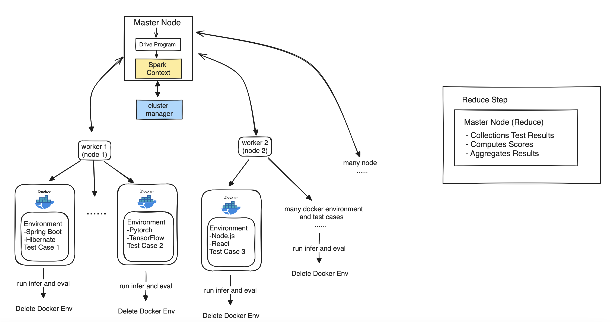

# LLM Code Capability Evaluation System

## Introduction
Welcome to the LLM Code Capability Evaluation System! This innovative system is engineered to assess the coding prowess of language model algorithms. Utilizing the power of PySpark, it implements distributed computing to process and analyze extensive datasets with remarkable efficiency.

## Evaluation Process
Our evaluation system encompasses three primary steps to ensure a comprehensive evaluation of each language model's capabilities:

1. **Infer**
2. **Evaluate**
3. **Summarize**

## Framework



## Getting Started

### Prerequisites
- Docker is enough


### Installation
To prepare the environment for code testing, you can either build the Docker image or pull it from Docker Hub using the commands below:

```bash
docker build -t mypytorch .
```
or
```bash
sudo docker pull michaelyang0050/llm_benchmark
```

## Jobs Directory
Within the `jobs` directory, you'll find multiple executable jobs. Each job is tailored to test a different model on a designated dataset, crafted to rigorously assess model performance and precision.

## Running the Tests
Navigate to the `jobs` directory and execute the job file of your choice to run a test. Ensure you have the correct permissions and that the environment variables are properly configured.just run:
```bash
sudo bash run_cluster.sh
```
or 
```bash
sudo bash run.sh
```
if you want to run it locally.


## License
This project is licensed under the MIT License - see the `LICENSE.md` file for details.

## Acknowledgments
- The PySpark community
- Docker Hub
- All the contributors who have played a role in developing this project

