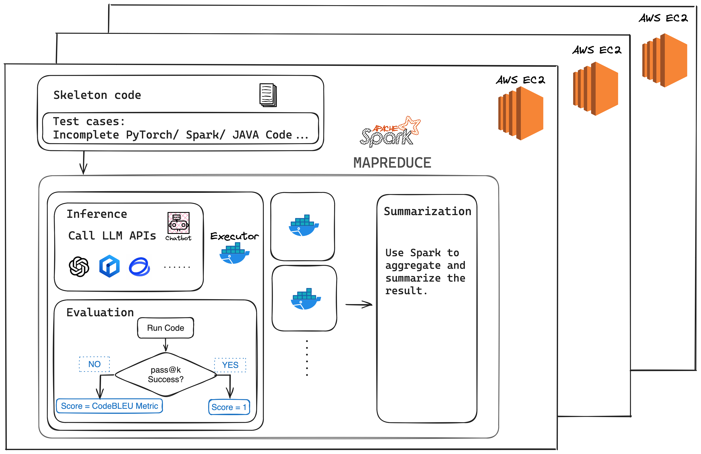

# LLM Code Capability Evaluation System

<!-- ALL-CONTRIBUTORS-BADGE:START - Do not remove or modify this section -->

[](#contributors-)

<!-- ALL-CONTRIBUTORS-BADGE:END -->

## Introduction

Welcome to the LLM Code Capability Evaluation System! This innovative system is engineered to assess the coding prowess of language model algorithms. Utilizing the power of PySpark, it implements distributed computing to process and analyze extensive datasets with remarkable efficiency. This benchmark can help to evaluate LLM's code capability in higher level like CV and NLP tasks. Here is an example case: https://github.com/MichaelYang-lyx/LLM-Code-Benchmark/tree/main/data/AItest/test2.

## Evaluation Process

Our evaluation system encompasses three primary steps to ensure a comprehensive evaluation of each language model's capabilities:

1. **Infer**


2. **Evaluate**


3. **Summarize**


## Workflow



## Framework


## Getting Started

### Prerequisites

- Docker is enough

### Installation

To prepare the environment for code testing, you can either build the Docker image by:

```bash
docker build -t mypytorch .
```

or pull it from Docker Hub using the commands below:

```bash
sudo docker pull michaelyang0050/llm_benchmark
docker tag michaelyang0050/llm_benchmark mypytorch
```

Then you need to create an .env file containning your API keys with the following format:

```
OPENAI_API_KEY= ...
BAIDU_SECRET_KEY= ...
...
```

## Jobs Directory

Within the `jobs` directory, you'll find multiple executable jobs. Each job is tailored to test a different model on a designated dataset, crafted to rigorously assess model performance and precision.

## Running the Tests

Navigate to the `jobs` directory and execute the job file of your choice to run a test. Ensure you have the correct permissions and that the environment variables are properly configured.just run:

```bash
sudo bash run_cluster.sh
```

or if you want to run it locally:

```bash
sudo bash run.sh
```

## Experiments

We test four different LLMs based on our benchmark. And the results are as follows:


## License

This project is licensed under the MIT License - see the `LICENSE.md` file for details.

## Acknowledgments

- The PySpark community
- Docker Hub
- All the contributors who have played a role in developing this project

## Contributors ✨

Thanks goes to these wonderful people ([emoji key](https://allcontributors.org/docs/en/emoji-key)):

<!-- ALL-CONTRIBUTORS-LIST:START - Do not remove or modify this section -->
<!-- prettier-ignore-start -->
<!-- markdownlint-disable -->
<table>
  <tbody>
    <tr>
      <td align="center" valign="top" width="14.28%"><a href="https://github.com/MichaelYang-lyx"><br /><sub><b>Michael</b></sub></a><br /><a href="https://github.com/MichaelYang-lyx/LLM-Code-Benchmark/commits?author=MichaelYang-lyx" title="Code">💻</a></td>
      <td align="center" valign="top" width="14.28%"><a href="https://github.com/ZixinMa27"><br /><sub><b>ZixinMa27</b></sub></a><br /><a href="https://github.com/MichaelYang-lyx/LLM-Code-Benchmark/commits?author=ZixinMa27" title="Code">💻</a></td>
      <td align="center" valign="top" width="14.28%"><a href="https://github.com/hareisland"><br /><sub><b>Z.Shen</b></sub></a><br /><a href="https://github.com/MichaelYang-lyx/LLM-Code-Benchmark/commits?author=hareisland" title="Code">💻</a></td>
      <td align="center" valign="top" width="14.28%"><a href="https://github.com/JifengCHN"><br /><sub><b>JifengCHN</b></sub></a><br /><a href="https://github.com/MichaelYang-lyx/LLM-Code-Benchmark/commits?author=JifengCHN" title="Code">💻</a></td>
    </tr>
  </tbody>
  <tfoot>
    <tr>
      <td align="center" size="13px" colspan="7">
        
          <a href="https://all-contributors.js.org/docs/en/bot/usage">Add your contributions</a>
        </img>
      </td>
    </tr>
  </tfoot>
</table>

<!-- markdownlint-restore -->
<!-- prettier-ignore-end -->

<!-- ALL-CONTRIBUTORS-LIST:END -->

This project follows the [all-contributors](https://github.com/all-contributors/all-contributors) specification. Contributions of any kind welcome!
